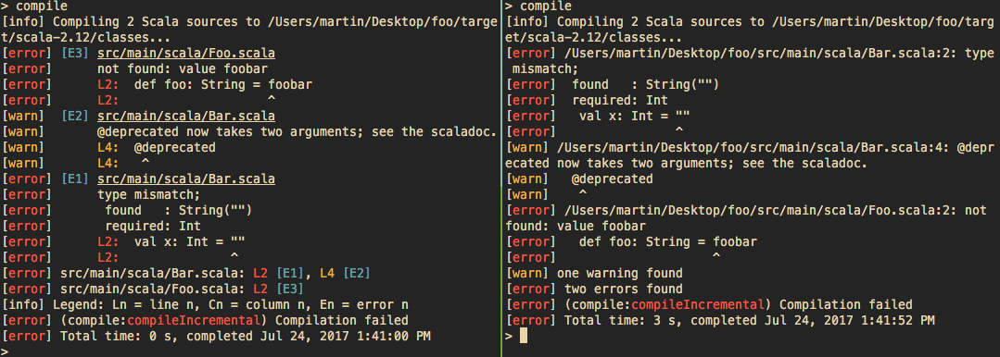

# sbt-errors-summary

A simple plugin that makes the error reporter a bit more concise.

I find it useful when doing refactoring: I get a lot of compilation errors, and I waste a lot of
time switching between files and looking for line numbers in the error message, when I can
immediately see what's wrong when looking at the faulty line.

- [Overview](#Overview)
- [Installation](#Installation)
- [Configuration](#Configuration)
- [Contributing](#Contributing)
- [Maintainers](#Maintainers)
- [Changelog](#Changelog)

# Overview

This plugin helps by summarizing all the errors per file.

Side by side comparison (this plugin on the left, origin on the right):



```
[info] Compiling 2 Scala sources to /Users/martin/Desktop/foo/target/scala-2.12/classes...
[error] [E1] src/main/scala/Bar.scala
[error]      type mismatch;
[error]       found   : String("")
[error]       required: Int
[error]      L2:  val x: Int = ""
[error]      L2:               ^
[warn]  [E2] src/main/scala/Bar.scala
[warn]       @deprecated now takes two arguments; see the scaladoc.
[warn]       L4:  @deprecated
[warn]       L4:   ^
[error] [E3] src/main/scala/Foo.scala
[error]      not found: value foobar
[error]      L2:  def foo: String = foobar
[error]      L2:                    ^
[error] src/main/scala/Bar.scala: L2 [E1], L4 [E2]
[error] src/main/scala/Foo.scala: L2 [E3]
[info] Legend: Ln = line n, Cn = column n, En = error n
[error] (compile:compileIncremental) Compilation failed
[error] Total time: 0 s, completed Jul 3, 2017 3:00:27 PM
```

# Installation

### sbt 1.0 or later

To enable this plugin globally, simply put the following in
`~/.sbt/1.0/plugins/plugins.sbt`:

```scala
addSbtPlugin("com.github.duhemm" % "sbt-errors-summary" % "0.6.5")
```

**The organization has changed between 0.6.3 and 0.6.4. Please update!**

You can also enable it for a specific project by putting the same line in
`project/plugins.sbt` in your sbt project.

### sbt 0.13

The last version of this plugin to support sbt 0.13 is 0.6.0.

To enable this plugin globally, simply put the following in
`~/.sbt/1.0/plugins/plugins.sbt`:

```scala
addSbtPlugin("org.duhemm" % "sbt-errors-summary" % "0.6.0")
```

You can also enable it for a specific project by putting the same line in
`project/plugins.sbt` in your sbt project.

# Configuration

This reporter supports several configuration options that let you change how errors
are reported. The configuration can be accessed via the `reporterConfig` setting key.
A configuration is represented by an instance of a `ReporterConfig`, which is
[generated from a Contraband schema](https://github.com/Duhemm/sbt-errors-summary/blob/master/src/main/contraband-scala/sbt/errorssummary/ReporterConfig.scala).

The examples can be copy pasted directly inside you global settings in sbt (`~/.sbt/1.0/global.sbt`)
or inside your build definition. If you enabled this plugin globally and want to configure it globally,
you'll also need to add the following import:

```scala
import sbt.errorssummary.Plugin.autoImport._
```

or start sbt with `sbt.global.autoimport` set to `true`.

The supported configuration options include:

 - `colors: Boolean = true`:
   Determines whether the reporter will produce a colored and formatted (as in bold,
   underlined, etc.) output. Defaults to `true`.
   Example:
   ```scala
   reporterConfig := reporterConfig.value.withColors(false)
   ```
   All the colors are configurable. See
   [ReporterConfig.contra](https://github.com/Duhemm/sbt-errors-summary/blob/master/src/main/contraband/ReporterConfig.contra)
   to see all the existing configuration keys.

 - `shortenPaths: Boolean = true`:
   Determines whether the reporter will strip the current working directory from paths
   it displays. Defaults to `true`.
   Example:
   ```scala
   reporterConfig := reporterConfig.value.withShortenPaths(false)
   ```

   Note (0.6.4+): For compatibility with IntelliJ and ENSIME's sbt-mode, the paths will never be shortened when:
    - the system property `idea.run` is set, or
    - the environment variable `INSIDE_EMACS` is set, or
    - the system property `sbt.errorssummary.full.paths` is set.

 - `columnNumbers: Boolean = false`:
   Determines whether the reporter will show the column number at which an error has been
   recorded, Defaults to `false`.
   Example:
   ```scala
   reporterConfig := reporterConfig.value.withColumnNumbers(false)
   ```

 - `reverseOrder: Boolean = false`:
   Determines whether the reproter will show the error messages in reverse order (first error
   displayed at the bottom of the screen.) Defaults to `false`.
   Example:
   ```scala
   reporterConfig := reporterConfig.value.withReverseOrder(false)
   ```

 - `showLegend: Boolean = true`:
   Determines whether to show a legend at the bottom for the various
   types of numbers (line, column, error). Note that despite this
   setting, a legend will still only be shown if there actually are
   errors, and not otherwise.
   Example:
   ```scala
   reporterConfig := reporterConfig.value.withShowLegend(false)
   ```

# Contributing

Information is available in the [contributing guide](blob/master/CONTRIBUTING.md)

# Maintainers

The current maintainers (people who can merge pull requests) are:

- Martin Duhem - [@Duhemm](https://github.com/Duhemm)

# Changelog

## 0.6.3
 - Drop support for sbt 0.13

## 0.6.0
 - Cross publish for sbt 1.0

## 0.5.0
 - Add `reporterConfig` key to configure the reporter. See examples in previous section.
 - Add configurable colors in [#21](https://github.com/Duhemm/sbt-errors-summary/pull/21)
 - Hide unknown positions in some errors in
     [#24](https://github.com/Duhemm/sbt-errors-summary/pull/24)
 - Option to reverse order of error messages (first error shown last) in
     [#28](https://github.com/Duhemm/sbt-errors-summary/pull/28)
 - Improve readability and show faulty line number on the left in
     [#27](https://github.com/Duhemm/sbt-errors-summary/pull/27) by
     [@yawaramin](https://github.com/yawaramin)
 - Add option to show legend in [#27](https://github.com/Duhemm/sbt-errors-summary/pull/27)
     by [@yawaramin](https://github.com/yawaramin)

### 0.4.1
 - Re-fix display of relative path in [#20](https://github.com/Duhemm/sbt-errors-summary/pull/20)

## 0.4.0
 - Fix display of relative path in [#10](https://github.com/Duhemm/sbt-errors-summary/pull/10)
 - Add `ReporterConfig` to configure how the reporter displays error messages in
   [#15](https://github.com/Duhemm/sbt-errors-summary/pull/15)
 - Add config option to show column number in
   [#16](https://github.com/Duhemm/sbt-errors-summary/pull/16)
 - Support source position mappers in [#17](https://github.com/Duhemm/sbt-errors-summary/pull/17)
 - Support `printWarnings` task in [#18](https://github.com/Duhemm/sbt-errors-summary/pull/18)

## 0.3.0
 - Show offending line again
 - Better alignment of messages
 - Write tests for the reporter, again multiple Scala versions in
   [#4](https://github.com/sbt-errors-summary/pull/4) and
   [#5](https://github.com/sbt-errors-summary/pull/5)
 - Address [feedback from discussion on Scala contributors](https://contributors.scala-lang.org/t/improving-the-compilation-error-reporting-of-sbt/935)
   in [#6](https://github.com/Duhemm/sbt-errors-summary/pull/6)
   - Start numbering problems at 1
   - Add a newline after file path
   - Highlight file name and line number
   - Disable colors and formatting in CI and Ensime
 - Relativize file paths from working directory in
   [#7](https://github.com/sbt-errors-summary/pull/7)

## 0.2.0
 - Apply `compilerReporter` to `Compile` and `Test` configurations, by
   [@jvican](https://github.com/jvican) and   [@Duhemm](https://github.com/Duhemm)
   in [#1](https://github.com/Duhemm/sbt-errors-summary/pull/1) and
   [#2](https://github.com/Duhemm/sbt-errors-summary/pull/2).

## 0.1.0
 - Initial version
